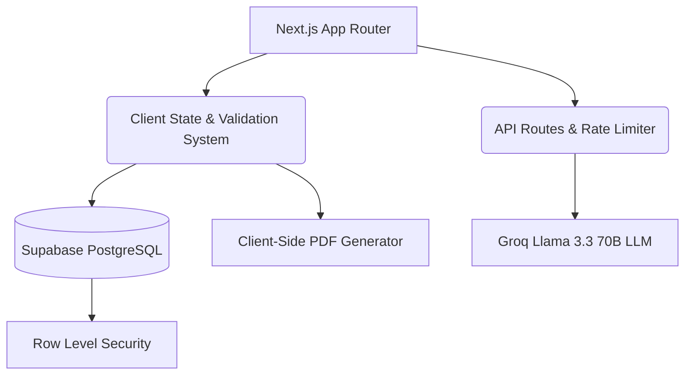

# WorkForce Compliance Manager (WFCM): Enterprise Labor Law Compliance Platform

[](https://wfcm.sejabur.dev)
[](#license)

**Live Application:** [wfcm.sejabur.dev](https://wfcm.sejabur.dev)

---

## Summary

The WorkForce Compliance Manager (WFCM) is an enterprise workforce operations and compliance platform designed to prevent labor law violations, employee burnout, and scheduling conflicts. By programmatically evaluating shifts against statutory labor standards (such as maximum weekly hours, mandatory rest periods between shifts, consecutive workdays, and role coverage), the platform replaces manual spreadsheets with automated compliance intelligence. It enables operations managers and compliance officers to maintain real-time oversight, generate structured risk briefs, and export executive PDF reports.


## Problem Statement

Organizations operating shifts across healthcare, retail, logistics, and emergency services must comply with complex labor laws, collective bargaining agreements, and internal safety policies. 

When shift schedulers manually assign shifts using traditional spreadsheets or disconnected software, subtle violations often go unnoticed (such as assigning an employee to a late-night shift followed by an early-morning shift without the statutory 10-hour rest gap, or exceeding maximum weekly hours). These oversights lead to regulatory fines, labor union grievances, operational fatigue, and elevated workplace hazard rates.

## Why This Product?

Workforce compliance management is frequently handled as a reactive post-audit process (often addressed only after regulatory penalties or union grievances are filed). The goal of WorkForce Compliance Manager is to shift compliance oversight from post-incident auditing to pre-execution prevention.

By combining an in-memory rule system with constrained risk briefing, this platform provides immediate visibility into shift breaches prior to shift execution, protecting worker well-being and organizational liability.

## Target Audience

This application is designed for:
- **Operations Managers & Schedulers** managing shift rosters across multiple teams.
- **Compliance & HR Officers** auditing labor law adherence and union agreement terms.
- **Department Directors** requiring high-level risk summaries and compliance score metrics.

## Product Objectives

The platform was engineered to achieve measurable operational outcomes:
- Eliminate manual shift-by-shift compliance auditing effort.
- Provide real-time warning indicators for overtime and rest period breaches.
- Standardize compliance scoring metrics across all operational units.
- Synthesize raw policy violations into concise risk intelligence briefs.
- Enable client-side export of executive audit dossiers for legal and board review.

## Key Product Decisions

Developing this platform required strict product judgment to prioritize deterministic compliance over discretionary logic:

1. **Proportional Compliance Scoring**  
   Rather than applying a binary pass or fail state to schedule integrity, the platform calculates a proportional compliance score (0-100%) weighted by violation severity (high, medium, low). A rest period violation of 4 hours demands immediate intervention compared to a minor rule warning. The weighted scoring model accurately reflects operational urgency.

2. **Constrained Intelligence Briefing**  
   Rather than using open-ended or conversational AI chat interfaces, the inference model (Groq Llama 3.3 70B) is strictly bound by prompt constraints. The model operates exclusively as a factual compliance analyst, generating structured summaries strictly from validated database violations to prevent output hallucination.

3. **Client-Side Dossier Generation**  
   PDF compliance reports are compiled and rendered entirely inside the user browser runtime. Sensitive employee schedules and internal labor policy configurations are never transmitted to third-party rendering APIs.

## Core Functionalities

### 1. Programmatic Rule Processing & Multi-Rule Validation
WFCM evaluates every shift against five core labor compliance rules:
- **Max Weekly Hours:** Flagging cumulative weekly work hours exceeding employee or policy caps.
- **Mandatory Rest Gap:** Detecting insufficient rest intervals between consecutive shifts (such as < 10 hours).
- **Max Consecutive Workdays:** Preventing burnout by flagging consecutive work spans exceeding limits.
- **Shift Velocity Limit:** Preventing multiple shift assignments within a single 24-hour window.
- **Role & Specialty Coverage:** Ensuring mandatory specialized roles are properly covered.

### 2. Risk Assessment Briefing
Integrated with the Groq inference engine to convert raw violation data into structured, plain-text risk briefs for leadership.

### 3. Executive PDF Report Generation
Users can export full compliance reports (including score breakdowns, active violations, and policy thresholds) into formatted PDF dossiers.

### 4. Role-Based Access Control (RBAC)
Enforces strict security boundaries between **Admin** (full management, policy editing, and scan execution) and **Staff** (view-only shift schedule access).

## System Architecture



## Technology Stack

**Frontend**
- Next.js 15 (App Router)
- React 19
- Vanilla CSS & Tailwind CSS

**Backend**
- Next.js API Routes

**Database**
- Supabase PostgreSQL

**Inference Platform**
- Groq Cloud API
- Llama 3.3 70B Versatile

**PDF Generation**
- jsPDF & AutoTable

## Future Roadmap

- Automated shift swap conflict checking
- Predictive overtime forecasting
- Multi-location labor law regulation presets
- Integration with enterprise HRIS platforms (Workday, BambooHR, SAP SuccessFactors)
- SMS and Email shift alert notifications

## Design Philosophy

The design philosophy of WFCM focuses on clarity, rapid data comprehension, and high-density operational visibility. Using a refined skeuomorphic design system, subtle micro-animations, custom UI pickers, and strict color-coded risk indicators, the interface minimizes cognitive load for operations personnel managing high-stakes shift schedules under time constraints.

## Security Overview

This application incorporates essential security safeguards to protect operational data:
- **Rate Limiting:** Sliding-window in-memory rate limiter on API endpoints enforcing a maximum of 5 requests per minute per IP address with HTTP 429 Retry-After headers.
- **Role-Based Access Control:** Strict permission verification separating Admin and Staff capabilities.
- **Input Sanitization & Injection Defense:** Server API routes escape HTML characters and validate payload boundaries to prevent prompt injection and XSS exploits.
- **Enterprise HTTP Security Headers:** Enforced via Next.js configuration including `X-Frame-Options: DENY`, `X-Content-Type-Options: nosniff`, `Strict-Transport-Security`, `Permissions-Policy`, and `X-DNS-Prefetch-Control`.
- **Passcode Visibility Controls:** Passcode inputs are masked by default with explicit toggle controls.

## Local Setup and Installation

### Prerequisites
- Node.js (v18 or higher)
- A Supabase Account (Optional - application includes client fallback)
- A Groq API Key (For Risk Briefings)

### Step 1: Clone the Repository
```bash
git clone https://github.com/Sejabur/WorkForce-Compliance-Manager.git
cd WorkForce-Compliance-Manager
```

### Step 2: Install Dependencies
```bash
npm install
```

### Step 3: Database Configuration (Optional)
1. Create a new project in Supabase.
2. Navigate to the SQL Editor in your Supabase dashboard.
3. Copy the contents of `supabase_schema.sql` from this repository and execute it to create the database tables and Row Level Security policies.

### Step 4: Environment Variables
Create a file named `.env.local` in the root directory and populate it with your credentials:
```env
NEXT_PUBLIC_SUPABASE_URL=your_supabase_project_url
NEXT_PUBLIC_SUPABASE_ANON_KEY=your_supabase_anon_key
GROQ_API_KEY=your_groq_api_key
NEXT_PUBLIC_ADMIN_PASSCODE=admin123
```

### Step 5: Start the Server
```bash
npm run dev
```

Open [http://localhost:3000](http://localhost:3000) in your browser.

## Notice of Liability

This application is provided "AS IS" and was developed to programmatically manage labor compliance and schedule risk. While the codebase implements standard security and validation measures, it is not actively maintained. Organizations deploying this open-source software must conduct their own legal and compliance audits before utilizing it in production environments handling real employee data. The author is not liable for any direct or indirect damages, compliance penalties, or operational failures resulting from the use of this software.

## License

This project is licensed under the MIT License. See the [LICENSE](LICENSE) file for details.
